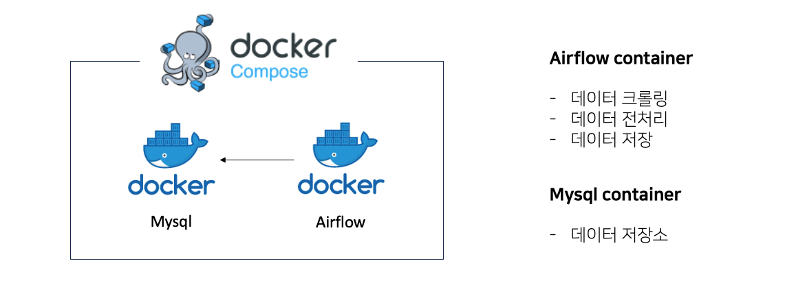
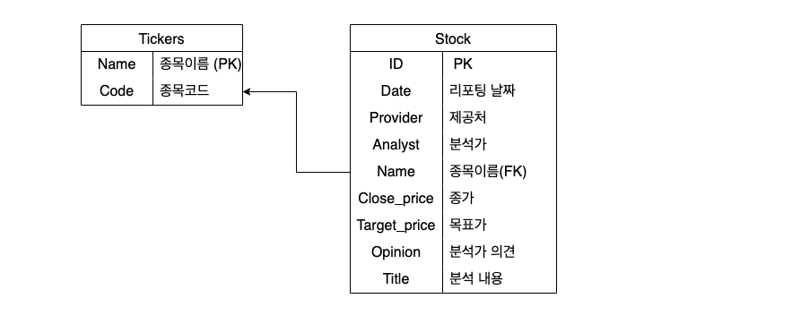

# Stock-Report

AIRFLOW를 사용한 증권사 리포트 수집/분석

## 환경

HOST : MAC PRO M1  
Docker : ubuntu:20.04 (platform: linux/arm64)  
Python : 3.8  
Airflow : 2.6.3  
Selenium : 4.10.0  
Browser : Firefox  
Driver : Geckodriver

## 개요




- KST 기준 일요일 자정 증권사 리포트 데이터 수집 및 저장


## 데이터베이스(Mysql)



### tickers

- 종목이름과 종목코드 테이블

### stock

- 증권사 분석 데이터 테이블


## 사용법

**docker compose**로 컨테이너들 실행

```bash
docker-compose up
```

- 일정 시간이 흐른 후 `localhost:8080`에 airflow webserver가 동작

- 기본적으로 아이디 : admin, 패스워드 : admin 로 로그인 가능

- crawling dag을 실행하면 일주일 간격으로 크롤링 및 데이터 저장 dag 수행

- `localhost:3307`에는 mysql 컨테이너가 실행중

<br>

```bash
docker run -it <실행중인 mysql 컨테이너>
```

- mysql 컨테이너에 접속 후 `mysql -u root -p` (기본 패스워드 : root)로 mysql 연결

- `use crawling`, `select * from stock`으로 데이터 저장 확인

## 수많은 오류들

1. M1 위에서 우분투 문제 : `--platform linux/arm64` 이미지 사용

2. 우분투에서 크롬 작동 문제 : `arm64` 위에서 제공하는 linux 크롬이 없어서 `firefox`로 변경

3. 테스트를 위해 로컬에서 airflow 작동시, `requests.get`이 작동하지 않는 현상

```
if _platform == "Darwin":
    from _scproxy import _get_proxy_settings
    _get_proxy_settings()
```

4. `selenium webdriver` 사용시 발생하는 오류들

```
options.add_argument("--headless")
```
위와 같은 옵션들을 추가하여 해결 가능


5. Host 환경이 바뀐다면 위의 `Dockerfile`의 설정들을 변경해주어야 함
